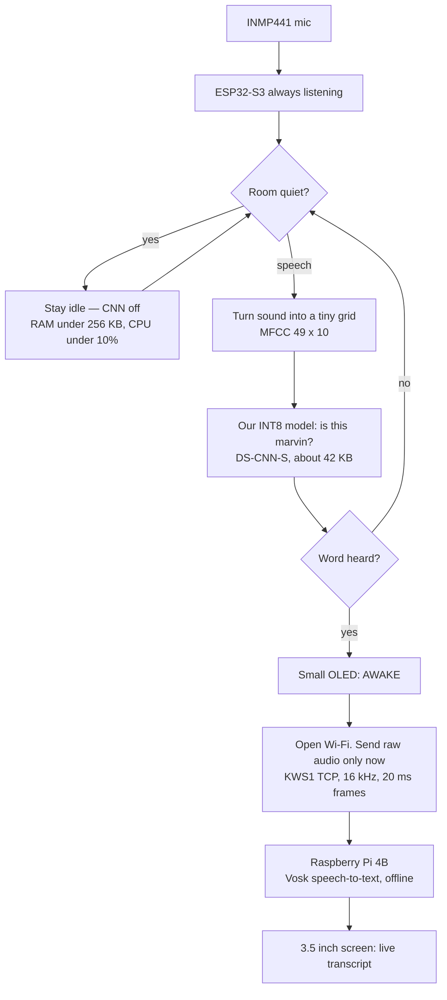

# Anuvaani — team briefing (not a slide deck)

Read this so everyone can explain the project. For each point: **understand**,
**say this** on stage, **Q&A** judges will ask.

Product **Anuvaani**. Spoken wake word **marvin**. PS **26172**.

**Never say:** “the Raspberry Pi uses 256 KB RAM” · “we use Alexa / Hey Google /
Porcupine” · “audio always goes to the cloud” · “TTS-only training” as if it were
our final accuracy · live TPR / FAR / latency numbers that are still **pending**.

The scored listen device is the **ESP32-S3**. The Pi is the **remote ASR + screen**.

---

## 0. One sentence

**Understand:** A small chip sits quietly and listens. Nothing is sent until it
hears *marvin*. Then it sends the *next* speech to the Pi, which shows live text.
No internet. No Google.

**Say:** “Anuvaani is always-on custom keyword spotting on a microcontroller. The
radio and the speech-to-text server stay off until the word is said. After wake we
stream only the following audio to a remote ASR.”

**Q&A**

- *Is this a voice assistant?* No. We only detect one custom word, then stream.
  We do not run Alexa, Gemini, or cloud STT for wake.
- *What is the product vs the word?* Product is Anuvaani. Spoken keyword is
  `marvin`. Same pipeline retrains to *sahayak* or any other word.

---

## 1. Flow (draw this, then talk)

**Understand:** Left side never leaves the chip. Right side exists only after wake.

**Say:** “Two phases. Always-on: mic, energy gate, tiny CNN on the S3. After wake:
OLED says AWAKE, we open a TCP pipe, Pi runs Vosk, screen shows live text.”

**Q&A**

- *Does the Pi listen all the time?* No. The S3 listens. The Pi only receives
  audio after a local detection.
- *What if the OLED is missing?* Firmware still runs. OLED is status only.

---

## 2. What the problem statement actually wants

**Understand:** Build a tiny, accurate **keyword spotting** model on a low-power
device. After the word, stream the **following** audio to a **remote ASR**.
Open-source TinyML only. Train a **custom** word — not Hey Google / Alexa.

They score three things:

| Score | Meaning in plain words |
| --- | --- |
| Efficiency | How small the model is, and how little CPU while *only* listening |
| Accuracy | Catch the real word; almost never wake on TV / other speech |
| Latency | From the **end of the spoken word** until ASR **receives** the first audio byte |

Official idle limits: **&lt; 256 KB RAM** and **&lt; 10% CPU** while waiting for
the keyword. After wake, stream CPU is allowed to go up.

**Say:** “The PS is not ‘build a chatbot’. It is: detect a custom keyword locally
under a tight RAM and idle-CPU budget, then stream subsequent audio to remote ASR
with low overhead.”

**Q&A**

- *Where is 256 KB / 10% in the PS?* Expected solution on the SIH portal: edge
  app under 256 KB RAM and under 10% CPU **while idling in continuous listening**.
- *Why not run everything on the Pi?* A Linux board cannot honestly claim a
  whole-system 256 KB listen path. The S3 can. We quote firmware RAM + arena, not
  “the Pi uses 185 KB”.
- *Is latency “time to detect”?* No. Keyword **ends** → ASR **receives** the
  stream. Detection delay after the word is part of that number.

---

## 3. Two boxes, two jobs

| Box | Job | Must not claim |
| --- | --- | --- |
| ESP32-S3 + INMP441 + OLED | Hear *marvin* on-chip | — |
| Pi 4B + 3.5″ screen | After wake: transcript + stats | That the Pi is the 256 KB device |

**Understand:** Judges score the listen chip. The Pi is the remote server the PS
asked for, plus a demo screen.

**Say:** “The ESP32-S3 is the always-on node. The Raspberry Pi is remote ASR and
the judge display. Split on purpose so moving the node does not rewrite the server.”

**Q&A**

- *Why both boards?* PS wants a low-power local detector **and** a remote ASR.
  One chip cannot honestly be both TinyML-idle and a full speech-to-text UI.
- *Can you demo without the Pi?* Wake + OLED yes. Live transcript needs the Pi
  on the same Wi-Fi.

---

## 4. Always-on path (this is what they score)

**Understand:** Every 20 ms the mic gives a short chunk.

1. If the room is almost silent, **do not run the neural net**.
2. If there is speech, turn 1 s of audio into a **49×10 MFCC** grid (a tiny
   fingerprint — not raw samples).
3. A small CNN (DS-CNN-S, INT8, ~42 KB) answers: keyword / unknown / silence.
4. Need a few high scores in a row (**debounce**) so one lucky frame from YouTube
   does not wake it.

Dual-core: audio never waits on a ~36 ms inference.

**Say:** “Idle path is capture plus an energy gate. The CNN is off in silence —
that is how we stay under 10% CPU. Features are MFCCs, the same recipe Hello Edge
uses. Model is DS-CNN-S quantized to INT8, TensorFlow Lite Micro plus ESP-NN.”

**Q&A**

- *Why not feed raw audio to the net?* 16,000 samples per second is too big and
  too noisy. MFCC is ~490 numbers for one second of speech.
- *Why DS-CNN-S?* Published TinyML KWS architecture. We did not invent a random
  net. The **word** lives in our training data, not in a vendor SDK.
- *Is TinyML “pretrained Alexa”?* No. Architecture can be known. The PS bans
  engines already trained on Hey Google / Alexa. We train `marvin` ourselves.
- *What is INT8?* Weights stored as 8-bit integers: smaller, faster on the S3.
  We train in float, then convert. Float and INT8 agree on argmax ~100% on our
  calibration clips.

---

## 5. After wake (stream + live text)

**Understand:** On detection the OLED shows AWAKE. The S3 opens **TCP** to the Pi
(`KWS1`). It sends 500 ms of audio from *before* the word (so the command start
is not lost), then live 16 kHz mono PCM in 20 ms frames. No MP3. Pi **Vosk**
turns that into text on the 480×320 panel. Stream ends on silence. No internet.

Once a second, **UDP TEL1** sends stats (`cpu`, `ram`, score, …) for the UI.

**Say:** “After the keyword we open a raw PCM socket — about 32 KB per second,
no codec. Vosk runs offline on the Pi. Judges see live partials on the touch
panel. We disclose: the PS says cloud ASR; ours is LAN so the demo works without
internet. The hop we measure is still node to remote server first byte.”

**Q&A**

- *Why not Google STT after wake?* Allowed for ASR, but then the venue needs
  internet and latency is a WAN number. Vosk is open-source and offline.
- *Is LAN “remote”?* Yes. Remote means not on the listen chip. We say LAN
  openly vs the word “cloud”.
- *Does wake audio leave the chip?* No. Only **subsequent** audio plus a short
  preroll after detection.
- *Why raw PCM not Opus?* Compression costs CPU and delay. 16 kHz int16 is
  tiny on Wi-Fi and the S3 can emit it with no codec.

---

## 6. Hardware (why this kit)

**Understand:**

- **ESP32-S3 DevKitC** — dual core, Wi-Fi, enough RAM to *measure* a KB-scale
  listen path honestly.
- **INMP441** — digital I2S mic, 3.3 V only. Pins: SCK **15**, WS **16**, SD **17**,
  L/R to GND, VDD to 3V3.
- **SSD1306 OLED** — SDA **8**, SCL **9**. Optional.
- **Pi 4B + 3.5″ panel** — Vosk + swipe UI.

**Say:** “S3 is the only board here that can claim the idle RAM and CPU quotas
without software tricks. Pi is ASR and UI, not the scored listener.”

**Q&A**

- *Why not Pico / Pi Zero for listen?* Weak DSP or Linux — idle 10% and 256 KB
  become a story, not a measurement.
- *Why I2S not USB mic?* Same mic we put on the microcontroller. USB would be a
  fallback, not the scored path.

---

## 7. Training (custom keyword)

**Understand:** We train DS-CNN-S on Google **Speech Commands v2** *marvin*
(thousands of real speakers, held-out test list) plus clips through our S3 mic.
Then INT8 export into firmware. Changing the word = change `KEYWORD`, retrain,
reflash — not a rewrite.

**Say:** “The PS forbids pretrained *assistant engines*, not a public research
dataset. Two thousand real voices beat a week of TTS. Product name stays
Anuvaani; the spoken word is swappable.”

**Q&A**

- *Why not sahayak on stage?* No public multi-speaker set for that word yet.
  `marvin` is honest this week. Same code path retrains to sahayak after we
  record the team.
- *Did you use Porcupine / WakeNet?* No. TFLM + ESP-NN only.
- *Did you detect the word by transcribing everything?* That would fail the PS:
  audio would leave before detection, and there would be no model size to report.

---

## 8. Numbers (only quote measured ones)

Copy from `docs/results.md` after `python -m tools.results_report`. Do not invent.

Typical measured (check the file before the round):

| Metric | Ballpark | Quota |
| --- | --- | --- |
| INT8 model | ~42 KB flash | — |
| Firmware static RAM | ~186 KB | &lt; 256 KB |
| TFLM arena | ~56 / 64 KB | inside listen path |
| Idle listen CPU | target &lt; 10% | &lt; 10% |
| MFCC / CNN invoke | ~30 ms / ~36 ms | fits the hop |

**Say:** “Model is 42 kilobytes. Listen-path RAM is under 256 KB. Idle CPU is
measured from the node while the CNN is gated off. Accuracy and latency we
report only from the tools, not from a demo feeling.”

**Pending until you run the tools — do not fake these on stage:**

- Live TPR (`tpr_test`)
- False accepts per hour on TV / YouTube (`far_test`)
- Keyword-end → ASR first byte (`latency_harness`)

**Q&A**

- *What is TPR / FAR?* True-positive rate = we wake when you say the word.
  False accept = we wake on other speech. PS wants high TPR and near-zero FA.
- *YouTube woke it — failed?* That is FAR. Threshold / debounce / noise clips
  are the fix. Do not claim 0 FA/hour until `far_test` is run.
- *Idle CPU above 10% in one log?* Quote the latest `bench` / `results.md`.
  Speech-state CPU is allowed to be high; only **idle listen** is capped at 10%.

---

## 9. Demo script (who says what)

1. Point at the S3: “This chip is listening. No audio is leaving.”
2. Show OLED / Pi LIVE page: listening, idle CPU.
3. Say **marvin** at ~1 m. OLED → AWAKE. Pi → “Hearing…” then text.
4. Speak a short command. Text appears without internet (airplane mode on the
   router is a strong demo if the LAN still works).
5. Swipe Pi: quota bars, path animation, about/compliance.
6. If asked, show serial `WAKE score=` or TEL1 line.

If wake fails: closer / louder once, then admit threshold vs far-field — do not
blame the PS.

---

## 10. Impact (close)

**Understand:** Privacy (room is not streamed 24/7). Kiosks / field devices.
Indic or college keywords: retrain, no vendor licence.

**Say:** “Always-on listening that does not upload a room. Swap the word, retrain,
reflash.”

**Q&A**

- *Commercial SDK would be more accurate.* Disallowed. Also a licence forever.
  Our word is ours.
- *What is novel?* Local TinyML wake under a measured 256 KB / idle-CPU budget,
  then a minimal PCM stream to open-source ASR — not a cloud assistant clone.

---

## Glossary (use these words)

| Word | Say it like this |
| --- | --- |
| KWS | “Was that our word?” Tiny yes/no. Not full speech-to-text. |
| ASR | “What did they say after the word?” Vosk on the Pi. |
| Energy gate | Skip the CNN in a quiet room. |
| INT8 / TinyML | Model squeezed to fit a microcontroller. |
| KWS1 | TCP audio pipe, S3 → Pi, only after wake. |
| TEL1 | One UDP status line per second. |
| Debounce | Need several high scores so TV does not wake us. |
| Preroll | 500 ms of audio kept so the command start is not lost. |

**References if asked:** Hello Edge (DS-CNN-S), MLPerf Tiny, TensorFlow Lite Micro,
Speech Commands v2, ESP-NN, Vosk.
